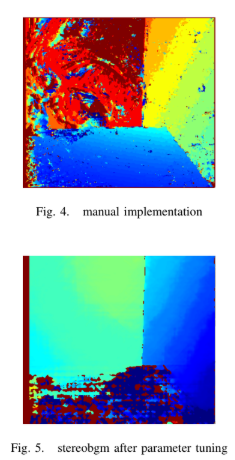

# Aerial Robotics Kharagpur | Entry Level Tasks

## Subtask 1: Depth Map Construction from Stereo Images

### Abstract
This project implements depth perception for the robot **Luna** by generating a depth map from stereo camera images. By calculating the disparity (horizontal shift) between corresponding points in left and right images, the system reconstructs a 3D understanding of the environment from 2D inputs.

**Key Applications:**
* **Autonomous Navigation:** Enabling robots to detect obstacles and maneuver in 3D space.
* **3D Reconstruction:** Generating spatial models from 2D stereo pairs.

---

### I. Introduction
The objective is to enable Luna to visualize distance. Using two parallel cameras, the system processes "left" and "right" views to produce a depth map where closer objects are highlighted in **red** and distant objects in **blue**.

**Development Iterations:**
* **Initial Attempt:** Used Shi-Tomasi and Harris Corner Detection. This resulted in sparse data points, insufficient for a dense depth map.
* **Final Approach:** Implemented a dense disparity search. While computationally heavier (~30-40s), it provides a comprehensive environmental visualization.

---

### II. Problem Statement
Luna requires a system to "see" and navigate. Given `left.png` and `right.png`, the goal is to develop a Python implementation from scratch that:
1.  Calculates the pixel-wise shift (disparity).
2.  Translates disparity into depth.
3.  Outputs a color-coded visualization (`depth.png`).

   
  left image                           right image 

---

### III. Methodology

#### 1. Technical Stack
* `OpenCV`: Image I/O and preprocessing.
* `NumPy`: Matrix operations and numerical analysis.

#### 2. Disparity Computation
The disparity is computed using a **Template Matching** approach:
* A window of size **5x5** is defined for each pixel in the left image.
* The system searches for the most similar window along the same horizontal axis in the right image.
* The horizontal offset is stored in a disparity matrix.


#### 3. Noise Reduction & Clipping
To ensure accuracy, we filter out featureless or flat regions:
* **Disparity Clipping:** Values outside the range **[2, 100]** are discarded based on percentile analysis. This removes outliers and focuses on relevant objects.

#### 4. Depth Calculation
Depth ($Z$) is calculated using the standard stereo vision geometry:

$$Z = \frac{B \times f}{d}$$

Where:
* $B$: Baseline (distance between cameras).
* $f$: Focal length.
* $d$: Disparity.

But however, we only need the relative depth for comput-
ing the depth map, and hence we assume ($B = f = 1$). We

note that depth varies from 0-0.49 but however the important
thing to note is that 93rd percentile is at 0.16 so the points
above that are of little use and hence i am clipping at a
suitable point.

**Optimization:**
Statistical analysis showed that the 93rd percentile of depth values lies at 0.16. To enhance contrast for closer objects, we clip the depth values:

```python
# Normalizing and clipping depth for better visualization
depth = np.clip(depth, 0, 0.14)
```
#### 4. Min-Max Normalisation

The depth map was then normalized using **Min-Max normalization** and processed for final visualization using the following steps:

```python
# Clipping at the 93rd percentile threshold
depth = np.clip(depth, 0, 0.14)

# Normalization, Color Mapping, and Dilation
colored_depth = cv.applyColorMap(normalized_depth, cv.COLORMAP_JET)
kernel = np.ones((3,3), np.uint8)
dilated_depth = cv.dilate(colored_depth, kernel, iterations=1)
```
Mathematical formula for the following is as follows:
$$x_{normalized} = \frac{x - x_{min}}{x_{max} - x_{min}}$$


### Results and observations
### Visual Interpretation
The generated depth map utilizes a pseudo-color representation to visualize the spatial distance of objects relative to the robot.

* 🔴 **Red (Near):** Depicts objects in close proximity to the robot.
* 🔵 **Blue (Far):** Depicts objects that are distant or part of the background.

This color scheme, based on the `COLORMAP_JET` gradient, provides an intuitive visualization where the transition from **Red** to **Blue** indicates a linear increase in distance.



we can clearly see that the implementation done manually
involves many trial or error and hence has much better
accuracy.

## Subtask2  
