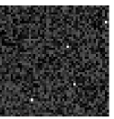
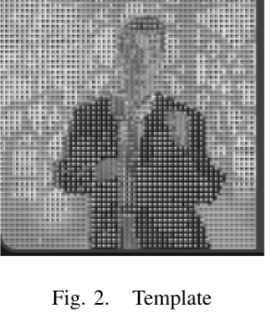
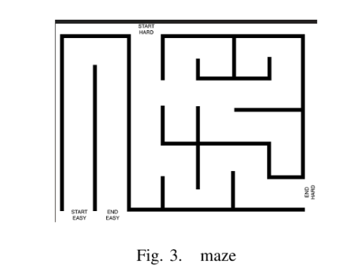

# Aerial Robotics Kharagpur | Entry Level Tasks

## Subtask 1: Depth Map Construction from Stereo Images

### Abstract
This project implements depth perception for the robot **Luna** by generating a depth map from stereo camera images. By calculating the disparity (horizontal shift) between corresponding points in left and right images, the system reconstructs a 3D understanding of the environment from 2D inputs.

**Key Applications:**
* **Autonomous Navigation:** Enabling robots to detect obstacles and maneuver in 3D space.
* **3D Reconstruction:** Generating spatial models from 2D stereo pairs.

---

### I. Introduction
The objective is to enable Luna to visualize distance. Using two parallel cameras, the system processes "left" and "right" views to produce a depth map where closer objects are highlighted in **red** and distant objects in **blue**.

**Development Iterations:**
* **Initial Attempt:** Used Shi-Tomasi and Harris Corner Detection. This resulted in sparse data points, insufficient for a dense depth map.
* **Final Approach:** Implemented a dense disparity search. While computationally heavier (~30-40s), it provides a comprehensive environmental visualization.

---

### II. Problem Statement
Luna requires a system to "see" and navigate. Given `left.png` and `right.png`, the goal is to develop a Python implementation from scratch that:
1.  Calculates the pixel-wise shift (disparity).
2.  Translates disparity into depth.
3.  Outputs a color-coded visualization (`depth.png`).

   
  left image                           right image 

---

### III. Methodology

#### 1. Technical Stack
* `OpenCV`: Image I/O and preprocessing.
* `NumPy`: Matrix operations and numerical analysis.

#### 2. Disparity Computation
The disparity is computed using a **Template Matching** approach:
* A window of size **5x5** is defined for each pixel in the left image.
* The system searches for the most similar window along the same horizontal axis in the right image.
* The horizontal offset is stored in a disparity matrix.


#### 3. Noise Reduction & Clipping
To ensure accuracy, we filter out featureless or flat regions:
* **Disparity Clipping:** Values outside the range **[2, 100]** are discarded based on percentile analysis. This removes outliers and focuses on relevant objects.

#### 4. Depth Calculation
Depth ($Z$) is calculated using the standard stereo vision geometry:

$$Z = \frac{B \times f}{d}$$

Where:
* $B$: Baseline (distance between cameras).
* $f$: Focal length.
* $d$: Disparity.

But however, we only need the relative depth for comput-
ing the depth map, and hence we assume ($B = f = 1$). We

note that depth varies from 0-0.49 but however the important
thing to note is that 93rd percentile is at 0.16 so the points
above that are of little use and hence i am clipping at a
suitable point.

**Optimization:**
Statistical analysis showed that the 93rd percentile of depth values lies at 0.16. To enhance contrast for closer objects, we clip the depth values:

```python
# Normalizing and clipping depth for better visualization
depth = np.clip(depth, 0, 0.14)
```
#### 4. Min-Max Normalisation

The depth map was then normalized using **Min-Max normalization** and processed for final visualization using the following steps:

```python
# Clipping at the 93rd percentile threshold
depth = np.clip(depth, 0, 0.14)

# Normalization, Color Mapping, and Dilation
colored_depth = cv.applyColorMap(normalized_depth, cv.COLORMAP_JET)
kernel = np.ones((3,3), np.uint8)
dilated_depth = cv.dilate(colored_depth, kernel, iterations=1)
```
Mathematical formula for the following is as follows:
$$x_{normalized} = \frac{x - x_{min}}{x_{max} - x_{min}}$$


### Results and observations
### Visual Interpretation
The generated depth map utilizes a pseudo-color representation to visualize the spatial distance of objects relative to the robot.

* 🔴 **Red (Near):** Depicts objects in close proximity to the robot.
* 🔵 **Blue (Far):** Depicts objects that are distant or part of the background.

This color scheme, based on the `COLORMAP_JET` gradient, provides an intuitive visualization where the transition from **Red** to **Blue** indicates a linear increase in distance.


*Figure 3: Final Depth Map visualization showing distance mapping (Red = Close, Blue = Far)*

we can clearly see that the implementation done manually
involves many trial or error and hence has much better
accuracy.


## SUBTASK 2: Image Restoration and Path Planning (RRT)

### Abstract
This project involves solving a multi-stage image processing puzzle to perform image restoration, template matching, and autonomous path planning. The workflow includes recovering a mathematical filter from distorted data, using it to decrypt an artwork, and finally implementing the **Rapidly-exploring Random Tree (RRT)** algorithm to navigate a maze.

**Key Applications:**
* **Image Restoration:** Retrieving original data from corrupted or "noisy" visual inputs.
* **Object Localization:** Identifying specific patterns within a complex collage.
* **Robot Path Planning:** Calculating obstacle-free paths in 2D environments.

---

### I. Introduction
The objective of this task, titled "2 Gebe dich nie auf," is to solve a series of interconnected puzzles to extract a password for a secured zip file. Once unlocked, the final goal is to implement a path-planning algorithm on the contained maze image.

---

### II. Problem Statement
The challenge is divided into five distinct technical phases:
1. **Filter Recovery:** Extracting digits of $\pi$ from a distorted image to form a $2 \times 2$ filter.
2. **Artwork Restoration:** Using bitwise operations to decrypt a distorted portrait.
3. **Template Matching:** Locating the restored portrait within a larger collage.
4. **Password Calculation:** Deriving a numeric password from the template coordinates.
5. **RRT Implementation:** Planning a path through a maze extracted from the zip file.

---

### III. Final Approach & Workflow

#### 1. Filter Recovery from Pi Image
The `pi.image.png` contains distorted digits. To recover them, each pixel value is multiplied by $10^7$ followed by a floor function. The first 2600 digits of $\pi$ were iterated to find four specific digits: **0, 3, 8, 9**. These are arranged in descending row-major order to form the following $2 \times 2$ filter:

$$Filter = \begin{bmatrix} 282 & 251 \\ 9 & 40 \end{bmatrix}$$

> 
*Figure 4:final image extracted from distorted pi image*

#### 2. Restoring the Portrait
The filter is applied to the distorted artwork window-by-window. Since the **XOR** bitwise operator is its own inverse, it was used to reverse the distortion and retrieve the original portrait.


> 
*Figure 5:final image extracted from distorted pi image*

#### 3. Template Matching & Password Extraction
The recovered portrait is scaled to $100 \times 100$ pixels and matched against `collage.png`. 
* The top-left corner coordinates $(x, y)$ are identified.
* The password is calculated by summing the abscissa and ordinate, then applying a scaling and rounding function.
* **Resulting Password:** `628`

#### 4. RRT-Connect Path Planning
The password unlocks a zip file containing a maze image. The **RRT-Connect** algorithm is implemented to find a valid path from the start to the goal within the maze boundaries.


>  
*Figure 6:final maze solved using rrt algorithm*

---

### IV. Results and Observations
The successful application of reverse engineering through bitwise XOR allowed for the perfect restoration of the "Rickroll" portrait. The RRT algorithm effectively explored the maze's configuration space to provide a valid navigation path.

### V. References
* [1] **Robot Path Planning: RRT Algorithm** - [Link to Medium Article]
* [2] **Rapidly-Exploring Random Trees** - [Link to GitHub]
* [3] **OpenCV Documentation** - [Link to Docs]
